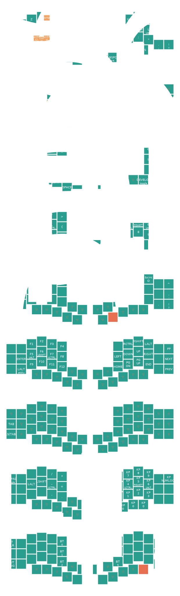

# Polty's Kyria keymap

Using keymap-drawer python package and the zmk container to run this repo.

It allows me to develop outside of the container, build, archive, and visualize keymaps.

## Keymap :
